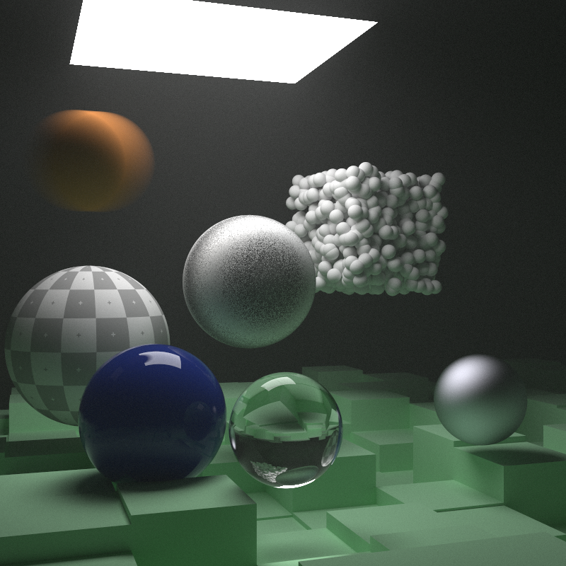

This repo. is implementation of [Ray Tracing: The Next Week](https://raytracing.github.io/books/RayTracingTheNextWeek.html) in Nim.

I appreciate the awesome authors for making this material open to the public.

# Note
This programs need [pixie](https://github.com/treeform/pixie).
```sh
nimble install pixie
```

The image size and sampling number are set a relatively small number.
If you want to change it, edit the values in the `src/scene.nim`

# Compile
```sh
cd src
make
```

# Run
```sh
make run
```

Rendered image will be saved in `src/outputs/rendered_img.ppm`

